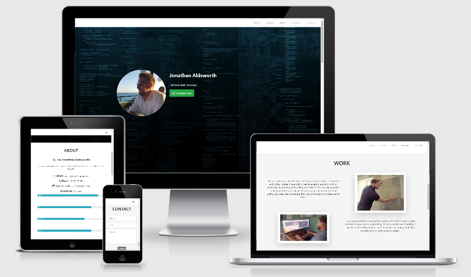
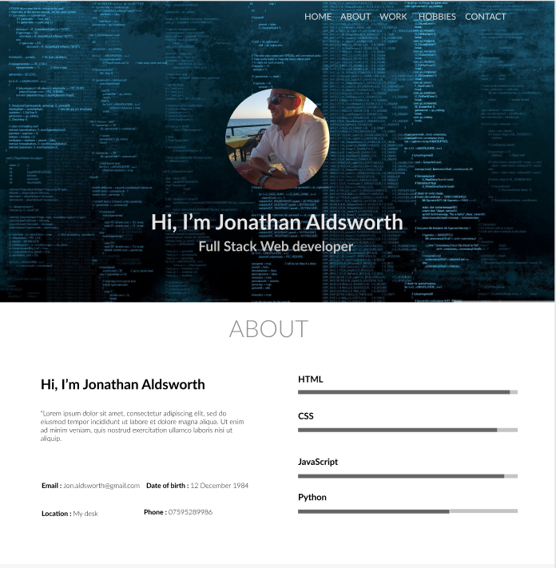
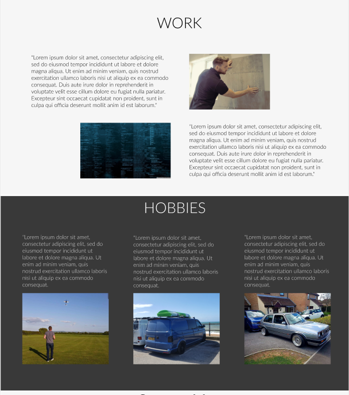
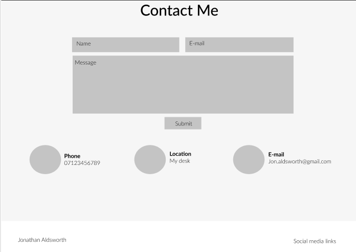
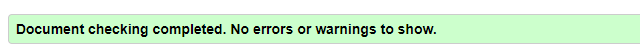
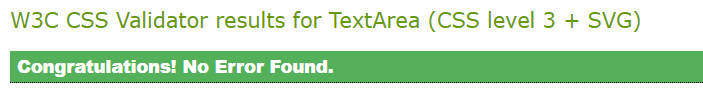
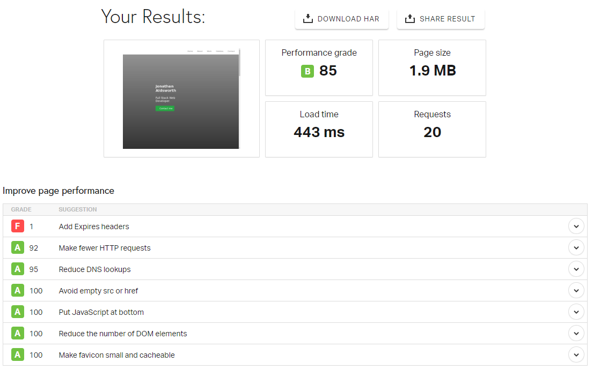

# My Resume

Milestone Project - 1 - My Resume

I have developed this page to provide a resume for employers. I choose to create this as a single page website with four sections.

The page has been designed to exhibit my skills in HTML and CSS that I have learnt so far on my Full Stack Web Development course with The Code Institute. 

Links below to my GitHub Pages and Github Repository:

- [Github Pages](https://jonathanuk84.github.io/Resume/.)

- [Github Repository](https://github.com/jonathanuk84/Resume)

# UX
This website has been designed to act as an online resume in the future when I am in a position to look for work as a Web Developer. It has been created showing my skills 
in HTML and CSS so far.

# User Stories
The main user for this site would be an employer looking to hire a Junior Web Developer.

# Wireframe

I desigined my site wireframe using Figma, please see link and screenshots below of my final draft. . 

[Figma - Click here to view my wireframe](https://www.figma.com/file/MQpvMBvXZ2Xhp8LNNiGMO6/Untitled?node-id=0%3A1)

My final product website has turned out exactly as planned with only 
a few little changes:

1.  The top navbar is now fixed at the top to ensure ease of navigation from all points on the page.
1.  The email/phone/location details in the contact section, as these are already displayed in the top about me section, felt it was unesseccary to repeat these items.
1.  I changed the colour scheme as the hobbies section in my initial draft stood out too much, I decided to go for a more clean and modern mix of white and light grey
alternating per each section for defintition and seperation. 

# Features
- **Home** - The background picture is a high-res coding image, overlayed with a portrait of myself introducing my name and future proffesion to potential employers 
at the first glance. 
- **About** - This section reinforces who I am, and informs the user that I am a student with Code Institute, providing contact information and displaying a bar 
chart to represent my skills (these may not be 100% accurate at the moment but will be amended as the course progresses.)
- **Work** - An overview of what I have currently achieved and my career goals for the future. 
- **Hobbies** - To make the resume more personal, I have added a section dedicated for the employer to get to know me better as a person. This displays three of my
main hobbies, all of which show my commitment and persiverance.
- **Contact** - I have added a contact form to the bottom section of the page for anyone to get in touch with me.
- **Footer** - Repeats my name and links to social media. 

# Technologies used
- [HTML(Hyper Text Markup Language)](https://developer.mozilla.org/en-US/docs/Web/HTML)
    * For Structure.
- [CSS(Cascading Style Sheets)](https://www.w3.org/Style/CSS/Overview.en.html)
    * For Styling 
- [Bootstrap](https://getbootstrap.com/)
    * For HTML and CSS framework
- [Font Awesome](https://fontawesome.com/v4.7.0/)
    * For icons
- [Figma](https://www.figma.com)
    * To draft a wireframe
- [Am I Responsive](http://ami.responsivedesign.is/)
    * To test responsiveness on all screen sizes
- [GitHub Pages](https://jonathanuk84.github.io/Resume/.)
    * Website hosted on GitHub pages
- [Git](https://git-scm.com/)
    * For version control
- [GitHub](https://github)
    * Repository hosted on GitHub
- [Chrome DevTools](https://developers.google.com/web/tools/chrome-devtools)
    * To check site throughout development and inspect
- [Pingdom](https://tools.pingdom.com/)
    * To test the load time of the page
- [HTML](https://validator.w3.org/) 
    * To validate my HTML code
- [CSS validater](https://jigsaw.w3.org/css-validator/validator)
    * To validate my CSS code
- [HTML formatter](https://www.freeformatter.com/html-formatter.html#ad-output)
    * To ensure all HTML is formatted correctly 

# Testing 
- [HTML Validator](https://validator.w3.org/) checked that all of my HTML code is valid.

- [CSS Validator](https://jigsaw.w3.org/css-validator/) checked that all of my CSS code is valid.

- [Am I Responsive](http://ami.responsivedesign.is/) checked that my page is responsive on all screen sizes

- [Pingdom](https://tools.pingdom.com) checked the load time for my page

- [Chrome Inspect Dev Tools](https://www.google.com/chrome/)

- Tested on different browsers
    * **Internet Explorer** The heading section layout changes when loaded in Internet Explorer, when on small screen sizes the image is too big and scrolls, 
    on larger screen sizes, the text starts overlapping the portrait photo, this will be rectified in a later update to the page. 

- Checked all links work correctly and open in a seperate page. 
    * The only exceptions are the contact me button in my heading and the links on the phone and email in the about section. These will
    be made functional at a later date. 

- Checked that the navbar scrolls to the correct part of the page.

- Checked that the back and forward browser buttons work correctly with no errors. 

- Post code in peer review on slack
    * No responses yet!

# Deployment and Demo 
The project is hosted on GitHub Pages

The process involved:

- Host a git repository on GitHub.
- Create project in GitPod saving each big change for version control to GitHub.
- Open your project repository in GitHub.
- Click on settings.
- Scroll down to the GitHub Pages section.
- Click on source and select master branch.
- After the page refreshes you will have a link to your deployed website.
- Final product now hosted on GitHub Pages.

To deploy your own version of the website:
- Have git installed
- Visit the repository
- Click 'Clone or download' and copy the code for http
- Open your chosen IDE (Cloud9, VS Code, etc.)
- Open a terminal in your root directory
- Type 'git clone ' followed by the code taken from github repository
- When this completes you have your own version of the website
- Feel free to make any changes to it
- The website can be run by opening one of the HTML files within a web browser
- Visit the link provided
- Your website with any made changes will appear
- Saved changes to the website will appear here after refreshing the page

The benefits of hosting your website on GitHub pages is that any pushed changes to your project will automatically update the website. Development branches can be created and merged to the master when complete.
It may take a moment for changes to appear on the hosted website.
During development the site is written in VS Code. It is run using Live Server plugin for VS Code.

# Credits 

- Images in **work** and **hobbies** taken and edited by myself. 

- Header background image taken from google: https://wallpaperaccess.com/4k-programming

# Acknowlegements 
 